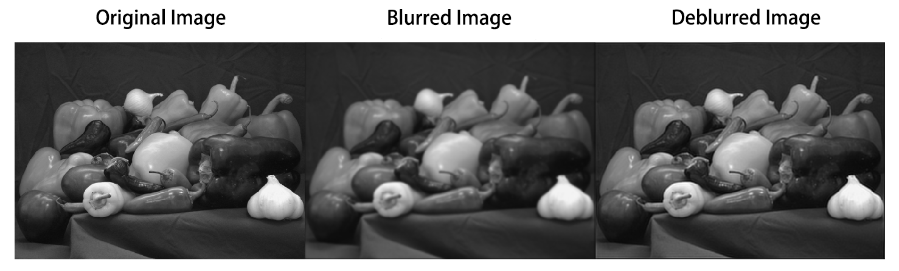

supervised_blur_kernel_estimation
========================================

This code is modified from [calculate blur kernel from original and blurry images](https://www.mathworks.com/matlabcentral/fileexchange/54944-calculate-blur-kernel-from-original-and-blurry-images) by [Dan Erez](https://uk.mathworks.com/matlabcentral/profile/authors/5519904-dan) 

However, our method is based on LEAST SQUARE FIT, which is more accurate than the original code. 
 
 
please run `demo_main.m` to see the results.

If you have the original image and the blurred image, you can use this code to estimate the blur kernel. 
 
 
results:

